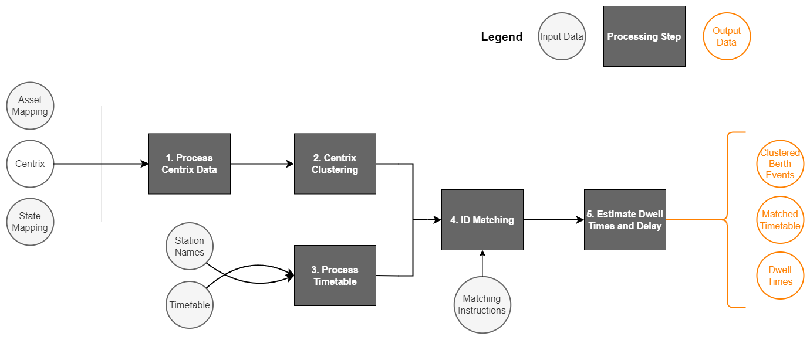

<!-- README.md is generated from README.Rmd. Please edit that file -->

# railvarr

<!-- badges: start -->

[](https://github.com/sebmerricks/railvarr/actions/workflows/R-CMD-check.yaml)
<!-- badges: end -->

The goal of railvarr is to …

## Installation

You can install the development version of railvarr from
[GitHub](https://github.com/) with:

``` r
# install.packages("devtools")
devtools::install_github("sebmerricks/railvarr")
```

## Pipeline

<figure>

<figcaption aria-hidden="true">Diagram of the processing pipeline that
railvarr provides</figcaption>
</figure>

## Getting Started

The first step is to massge your raw data into the correct structure, as
railvarr provides no reading functionality.

### Centrix

A detailed overview of what is expected for Centrix data can be found in
[wrangle_centrix()](https://sebmerricks.github.io/railvarr/reference/wrangle_centrix.html).
Here is an example of a valid Centrix data frame:

``` r
data(raw_centrix)
head(raw_centrix, 10)
#>      asset                  dt transition
#> 1  TA-1 TR 2000-01-01 06:13:48   UP to DN
#> 2  S1 HHGE 2000-01-01 06:13:49   UP to DN
#> 3   S1 HGE 2000-01-01 06:13:49   UP to DN
#> 4   S1 RGE 2000-01-01 06:13:49   DN to UP
#> 5  TA-1 TR 2000-01-01 06:25:29   DN to UP
#> 6  TA-1 TR 2000-01-01 06:25:31   UP to DN
#> 7  TA-1 TR 2000-01-01 06:25:43   DN to UP
#> 8  S1 HHGE 2000-01-01 06:25:48   DN to UP
#> 9   S1 HGE 2000-01-01 06:25:48   DN to UP
#> 10  S1 RGE 2000-01-01 06:25:48   UP to DN
```

## Timetable

A detailed overview of what is expected for Timetable data can be found
in
[wrangle_timetable()](https://sebmerricks.github.io/railvarr/reference/wrangle_timetable.html).
Here is an example of a valid Timetable data frame:

``` r
data(timetable)
head(timetable, 10)
#>    train_header           dt_origin    geo     event                 wtt
#> 1          168H 2000-01-01 12:05:00   geo1 Originate 2000-01-01 12:20:00
#> 2          168H 2000-01-01 12:05:00  geo18    Arrive 2000-01-01 12:23:00
#> 3          168H 2000-01-01 12:05:00  geo18    Depart 2000-01-01 12:24:00
#> 4          168H 2000-01-01 12:05:00   geo2    Arrive 2000-01-01 12:28:00
#> 5          168H 2000-01-01 12:05:00   geo2    Depart 2000-01-01 12:29:00
#> 6          168H 2000-01-01 12:05:00   geo3    Arrive 2000-01-01 12:35:30
#> 7          168H 2000-01-01 12:05:00   geo3    Depart 2000-01-01 12:36:30
#> 8          168H 2000-01-01 12:05:00 geo104    Arrive 2000-01-01 12:39:00
#> 9          168H 2000-01-01 12:05:00 geo104    Depart 2000-01-01 12:39:30
#> 10         168H 2000-01-01 12:05:00   geo4    Arrive 2000-01-01 12:41:30
#>                      t delay allow allow_perf allow_path allow_eng
#> 1  2000-01-01 12:19:00   -60     0          0          0         0
#> 2  2000-01-01 12:23:00     0     0          0          0         0
#> 3  2000-01-01 12:24:00     0     0          0          0         0
#> 4  2000-01-01 12:27:00   -60     0          0          0         0
#> 5  2000-01-01 12:28:00   -60     0          0          0         0
#> 6  2000-01-01 12:34:00   -90    90          0          0        90
#> 7  2000-01-01 12:35:00   -90     0          0          0         0
#> 8  2000-01-01 12:38:00   -60     0          0          0         0
#> 9  2000-01-01 12:38:00   -90     0          0          0         0
#> 10 2000-01-01 12:41:00   -30     0          0          0         0
```
