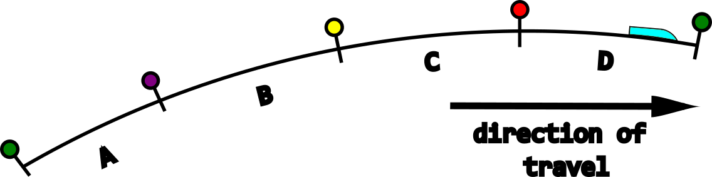
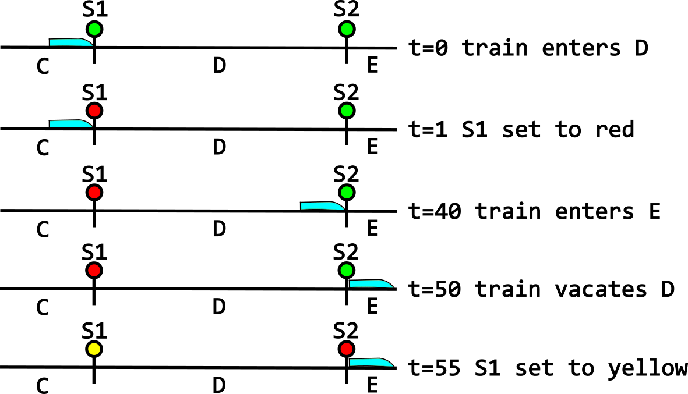

```{r, include = FALSE}
knitr::opts_chunk$set(
  collapse = TRUE,
  comment = "#>"
)
```

```{r setup}
library(railvarr)
```

# Introduction

This vignette will guide you through the `railvarr` processing pipeline from
start to finish. It is assumed that you are already in possession of Centrix
and timetable data.

`railvarr` provides no functionality for reading raw data. Instead, you should
massage your data to match the description of `raw_centrix` in 
`wrangle_centrix()` and of `timetable` in `wrangle_timetable()`.

# Centrix

## Overview

Railway tracks are separated into distinct blocks, called berths. These berths
are protected by signals. In this example, there is a train in berth D and the
signals are using a [4-aspect system](https://safety.networkrail.co.uk/jargon-buster/four-aspect-signal/).

```{r out.width = '100%', echo = FALSE}

```

Each berth is made up of one or more track sections, which are fitted with [track circuits](https://www.networkrail.co.uk/stories/track-circuits-explained/). 
These track circuits detect the presence or absence of trains, triggering 
changes in the signalling system.

Centrix data comes from the state transitions caused by train movements, 
detected by track circuits.

```{r out.width = '100%', echo = FALSE}

```

Note that there is a small offset between the train entering a berth and the 
signal changing to red. There is also an offset between the train vacating the 
berth and the signal changing to yellow.

The Centrix observations derived from these events would be as follows:
```{r echo = FALSE}
dplyr::tribble(
  ~asset, ~dt, ~transition,
  "D TR", 0, "UP to DN",
  "S1 DGE", 1, "UP to DN",
  "S1 RGE", 1, "DN to UP",
  "E TR", 40, "UP to DN",
  "D TR", 50, "DN to UP",
  "S1 RGE", 55, "UP to DN",
  "S1 HGE", 55, "DN to UP"
)
```

The track (denoted by a `" TR"` suffix on the asset ID) transitions come from 
the track circuits. Therefore, `"UP to DN"` denotes a train entering the track,
while `"DN to UP"` denotes a train vacating the track.

Signal transitions are different, with `"UP to DN"` representing a change FROM a
state, while `"DN to UP"` represents a change TO a state. Therefore, the second
observation says that signal `S1` changed off of green (`DGE`) at time `1`. The
third observation correspondingly says that signal `S1` changed to red (`RGE`) 
at time `1`. The signal state (which corresponds to its aspect) is embedded as a
suffix to the asset ID.

## Processing

`railvarr` provides a number of functions to facilitate the processing of 
Centrix data. These functions are wrapped by the function `wrangle_centrix()`.
See the specific function documentation for more details.

`wrangle_centrix()` requires raw Centrix data as described in the previous 
section, as well as a map of the track sections of interest. This map specifies 
which signals, tracks, and berths make up the section. Since berths can contain
more than one track but only one signal, the map provides a 1-1 mapping from 
signal to berth, and a 1-many mapping from berth to track. 

The map also contains a column named `event`, which represents the fact that a 
train can both enter and vacate a track. This allows for finer control over the 
start and end of the track section. For example, if we wanted to have access to 
the time at which the train entered berth E, we would have to include an 
`'enters'` event for berth E in the map.

The map for the previous example of berths C to E would be as follows:

```{r echo = FALSE}
dplyr::tribble(
  ~signal, ~berth, ~track, ~event,
  "S1", "D", "TD", "enters",
  "S1", "D", "TD", "vacates",
  "S2", "E", "TE", "enters"
)
```

Note that we don't need to include berth C in the map unless we wanted access to
the time at which the train vacated that berth. To process the 7 observations 
derived from the example, this map is sufficient.

This representation of the network map is limited, as it can only handle linear
sections of track, travelling in a single direction. More complex track layouts 
such as junctions are not supported.

With a `raw_centrix` data frame along with the `asset_map`, you can process the
data using:

```{r}
data(raw_centrix, asset_map)
raw_centrix
asset_map
railvarr::wrangle_centrix(raw_centrix, asset_map)
```

You can access these example data sets by running
`data(raw_centrix, asset_map)`. As you can see, the resulting data frame 
contains the timings that we saw earlier:

 * `t_enters`: time the train enters the berth
 * `t_red_on`: time the signal changes to red
 * `t_enters_next`: time the train enters the next berth
 * `t_vacates`: time the train vacates the berth
 * `t_red_off`: time the signal changes from red
 
The `aspect` column gives the signal aspect that the train saw as it entered the
berth. In our previous example, the train saw a green (`G`) aspect as it entered
berth D.

The processed data frame contains calculated durations as well as timings. These 
durations are derived from `TSAR`, which is equal to `t_red_off - t_red_on`. 
`TSAR` stands for 'Time Signal At Red' and represents the amount of time (in 
seconds) that the signal spent on a red aspect. The other durations calculated 
are:

 * `T_onset`: `t_red_on - t_enters` time between train entering berth and 
                    signal changing to red
 * `T_clear`: `t_vacates - t_enters` time taken for train to completely clear
                    the berth
 * `T_offset`: `t_red_off - t_vacates` time between train vacating berth and 
                    signal changing from red
 * `T_travel`: `t_enters_next - t_enters` time taken for train to travel the
                    length of the berth
 * `T_coach`: `t_vacates - t_enters_next` time taken for train to travel its own
                    length

`wrangle_centrix()` also performs data validation, potentially resulting in the 
loss of around 5% of data points. However, this is necessary to ensure that the 
resulting journeys contain valid data. As part of this, the function identifies 
individual train journeys, labeling each train with a unique ID number.

## Clustering

Centrix data contains no information about stopping patterns. However, they can 
be deduced from travel times. As you can see from the following plot, there are 
obvious differences in travel times in the berths which contain stations.

```{r echo = FALSE}
plot_clusters(dplyr::mutate(berth_events, cluster = 1))
```

These differences can be categorised using K-means clustering. This is automated
by the function `cluster_journeys()`. This data set contains 3 distinct groups 
of trains, which can be specified using the `centers` parameter.

```{r}
berth_events_clusters <- cluster_journeys(berth_events,
                                          centers = 3L,
                                          iter.max = 40L)
plot_clusters(berth_events_clusters)
```

Because K-means clustering is a stochastic algorithm, the results of 
`cluster_journeys()` are occasionally not what would be expected. In that case, 
simply run the clustering again. Some trains may also be miscategorised. This 
can be diagnosed visually using `plot_clusters()`, but it is unfortunately a 
manual process to remedy the issue.

# Timetable

## Processing

Again, `railvarr` provides no functionality for reading raw data. Therefore, the
first step is to make sure your data lines up with what `railvarr` expects. A
timetable is a list of events. Each event belongs to a train, denoted by its
[headcode](https://www.rail-record.co.uk/understanding-a-headcode/) 
(`train_header`) and the time and date at which it originated (`dt_origin`). An 
event also takes place at a geographical location, commonly known as a 
[TIPLOC](http://www.railwaycodes.org.uk/crs/crs0.shtm). In `railvarr` 
timetables, TIPLOCs live in the `geo` column. We then also have the type of 
event, which is contained in the `event` column. An event can have one of the
following types:

 * `Pass`       train passes without stopping
 * `Arrive`     train arrives at a station
 * `Depart`     train departs a station
 * `Originate`  where the train originates from
 * `Terminate`  where the train will terminate
 
Each event has a scheduled time (`wtt`) and an actual time (`t`), as well as a 
delay (`delay`) which is simply the difference between the actual and scheduled
times. There is a further column named `allow`, which is used for any timetabled
delay allowance. This is commonly used for ECS trains (headcode starts with '5')
as they often incur delays waiting for passenger services. The allowance means 
that delays can be expected and aren't necessarily problematic. For further
information on the expected structure of a raw timetable, see 
`wrangle_timetable()`.

Once your timetable is in the correct structure, you can go ahead and use the
`wrangle_timetable()` function. This function wraps three processing functions:

 * `filter_relevant_services()`
 * `filter_relevant_direction()`
 * `find_calling_patterns()`

There are two extra parameters required for `wrangle_timetable()`: `stations`
and `stopping_stations`.

`stations` should be a list of TIPLOCs (`geo`) through which trains pass. This 
list is used to work out which trains travel through the track section of 
interest. For example, there could be a fork in the track, where trains can 
travel to the left or to the right. If you want to only look at trains which 
turn to the left, `stations` would include all the TIPLOCs of interest which 
are situated along the left track. Any trains which do not pass through any
of the TIPLOCs specified in `stations` will be discarded.

`stopping_stations` should be a subset of `stations`, which specifies which 
TIPLOCs trains can stop at. This is used for calculating calling patterns. 
Therefore, any train which does not stop at any of the stations specified in 
`stopping_stations` will be labeled as a 'fast' train. Trains which do stop at
these stations will be labeled with 'stopping-', with the specific stations at 
which they stop attached as suffixes. For example, if a train stops at 'geo10', 
its calling pattern will be labeled as 'stopping-geo10'.

```{r}
# Load example data from railvarr
data(timetable, stations, stopping_stations)
# Raw timetable: note the number of observations and that none of the TIPLOCs 
# (`geo`) appear in the list of stations
timetable
# List of TIPLOCs defining the track section of interest
stations
# List of stations in the track section at which trains stop
stopping_stations
# Processed timetable: not how few observations persist, fewer than 10%; note 
# also that all the TIPLOCs apear in stations
railvarr::wrangle_timetable(timetable, stations, stopping_stations)
```

## Specifications

We can use the scheduled times in the timetable to calculate how long it should
take to travel along the track. This can be calculated using 
`calculate_journey_specifications()`. It can be useful to know expected journey
times, for example to inform the ID matching process. The function requires a 
timetable and a list of stations for which to calculate journey specifications.
Using the example dataset, we can use the following list of stations:

```{r echo = FALSE}
list("geo6", "geo110", "geo111", "geo112", "geo7")
```

This list encompasses the track section contained in the Centrix data. However,
you can alter this however you like.

# ID Matching

## Overview

Although it is possible to analyse Centrix and timetable data in its current, 
processed form, further analysis can be performed by combining these two 
datasets. To do this, Centrix train journeys must be matched to timetabled 
journeys. This is a fuzzy process, because times in timetables are rounded to 
the nearest 15/30 seconds. In the example dataset, times are rounded to the 
nearest 30 seconds. Furthermore, some Centrix journeys may not be present in the
timetable and vice-versa. As a result of these issues, the ID matching process 
can result in a lot of data loss. It is recommended that you manually check your
results for outliers and mismatches.

ID matching uses the fact that berths in the Centrix data line up with TIPLOCs 
in the timetable. In the example dataset, berth A corresponds to TIPLOC geo110 
which represents a station. Which berths and TIPLOCs to make use of depends on 
the train's stopping pattern. A train which stops at geo110 and nowhere else can
only be matched at that station. This is because these trains will likely not
include any other information in the timetable. The only TIPLOCs (and therefore
berths) which are included in the timetable are usually only junctions (a `Pass`
event) and stations at which the train stops (one `Arrive` and one `Depart` 
event). There can be more `Pass` events, but this is not guaranteed.

## `match_mapping`

You can specify where to perform the ID matching using the `match_mapping` 
parameter. This is a data frame with 5 columns:

 * `group`: the train group, e.g. 'fast' or 'stopping-all'
 * `berth`: the berth at which to match, e.g. berth 'A'
 * `geo`: the TIPLOC at which to match, e.g. 'geo110'
 * `lb`
 * `ub`
 
The columns `lb` and `ub` dictate the matching tolerance. In order to understand
how they work, you have to understand what the algorithm is doing on the inside 
and what constitutes a match. In the Centrix data, we have two important timings
for matching: `t_enters` and `t_vacates`. `t_enters` is when the train entered 
the berth and `t_vacates` is when the train vacated the berth. In the timetable,
we have two slightly diferent timtings: `t_Arrive` and `t_Depart`. `t_Arrive` is
the time at which the train arrived at the station and `t_Depart` is the time at
which the train departed the station. We can say that a Centrix observation and 
a timetable observation match if the train entered the berth before arriving at
the station and if the train vacated the berth after departing the station:

`t_enters < t_Arrive & t_Depart < t_vacates`

Conceptually, `t_enters` and `t_vacates` define a window of time in which 
`t_Arrive` and `t_Depart` must exist in order for a match to be made. Due to the
inherent fuzziness of timetable observations, you may wish to extend or shrink
this time window. This is done using the two previously mentioned columns: `lb`
and `ub`. These are used to alter the previous expression as follows:

`t_enters + lb < t_Arrive & t_Depart < t_vacates + ub`

Therefore, if I want to match trains in the group 'stopping-geo110', I can use
the following `match_mapping`:

```{r echo = FALSE}
dplyr::tribble(
  ~group, ~berth, ~geo, ~lb, ~ub,
  "stopping-geo110", "A", "geo110", 0, 0
)
```

If I want to generate more matches, I can extend the time window by 30 seconds
in both directions using the following edited `match_mapping`:

```{r echo = FALSE}
dplyr::tribble(
  ~group, ~berth, ~geo, ~lb, ~ub,
  "stopping-geo110", "A", "geo110", -30, 30
)
```

In general, it is recommended to start with restrictive time windows, extending 
them if you want more data after matching. However, because ID matching can 
result in significant data loss, you can expect to increase the matching 
tolerance by extending the matching time window using `lb` and `ub`.

## Fast trains

So far, we have only considered stopping trains, which can be matched at 
stations using `t_Arrive` and `t_Depart`. However, fast trains do not stop by
definition. Yet, they still pass through various TIPLOCs (usually junctions) 
with a `t_Pass` timing. In the example dataset, trains pass through a junction 
just before entering the track section. Therefore, all fast trains have a 
`t_Pass` timing that occurs prior to their entry into the Centrix track section.
In order to make use of this, it is necessary to know how long it should take a
train to travel from the junction to the first Centrix berth. This can be found
by using the `calculate_journey_specifications()` function.

The matching expression for fast trains is slightly different:

`t_enters + lb < t_Pass & t_Pass < t_enters + ub`

Essentially, a match can be made if the timetable observation occurs in-between
`t_enters + lb` and `t_enters + ub`. Therefore, you can use `lb` and `ub` to 
specify the exact time window in which a match can occur. In our example 
dataset, it should take no more than 4 minutes (240 seconds) to travel from the 
junction to berth A. Therefore, we can set `lb = -240` to say that `t_Pass` 
should occur no more than 240 seconds before `t_enters`. We can use `ub` to 
specify the end of the window. For example, if we want relatively high 
tolerance, we can set `ub = 60`. This says that `t_Pass` can occur up to 60
seconds after `t_enters`. The `match_mapping` for this would be:

```{r echo = FALSE}
dplyr::tribble(
  ~group, ~berth, ~geo, ~lb, ~ub,
  "fast", "A", "geo6", -240, 60
)
```

Note that 'geo6' refers to the junction prior to the Centrix berths. You can 
play around with `lb` and `ub` until the results look right to you.

Your `match_mapping` should include details for all of your train groups. For 
example, combining `fast` and `stoping-geo110` trains would result in the 
following `match_mapping`:

```{r echo = FALSE}
dplyr::tribble(
  ~group, ~berth, ~geo, ~lb, ~ub,
  "stopping-geo110", "A", "geo110", -30, 30,
  "fast", "A", "geo6", -240, 60
)
```

## Clustering

Because ID matching makes use of train groups, Centrix clustering is a 
pre-requisite. See `cluster_journeys()`. You should make sure that you label
your clusters to match the calling patterns in the timetable.

# Dwell Times

It can be useful to separate travel times into moving time and dwell time. Dwell
time analysis is important because stopping at stations represents one of the 
largest sources of variability in train travel times (citation needed?). 

## Berth Lengths

In order to calculate dwell times from TSAR, we need to know trains' velocities 
when entering and exiting the berths. To calculate these velocities, we need to
know the berth lengths. It appears that berth length data can be unreliable, so
`railvarr` provides a function to estimate lengths based on the expected journey 
time and a known reference length.

A reference length can be obtained by, for example, measuring the track length 
on Google maps. The expected journey time can be obtained from the timetable
specification. It is recommended to look at normal fast trains. The function 
`estimate_berth_lengths()` finds trains with a scheduled journey time equal to 
the expected journey time. It then calculates the median Centrix travel time for
those trains at each berth. Then, for each berth, it calculates the estimated
berth length using the median travel time and expected speed. The expected speed
is calculated using the expected journey time and the reference length.

In our example dataset, the track length is 5.97 miles and the expected journey
time is 270 seconds. 

```{r}
data(timetable_specification, id_matching, berth_events_groups)
railvarr::estimate_berth_lengths(timetable_specification,
                                 id_matching,
                                 berth_events_groups,
                                 expected_journey_time = 270,
                                 track_length = 5.97)
```

## Dwell Times

Once in possession of berth lengths, it is possible to estimate dwell times. 
Unless you are interested in delays, ID matching is not necessary for dwell time
estimation. This is helpful as it does not expose dwell times to the data loss
caused by the ID matching process. Estimating dwell times is easy using the 
`estimate_dwell_times()` function. This function takes 6 parameters, with an 
optional seventh.

The first parameter is the grouped Centrix data obtained from the clustering 
process. Second, you need the berth lengths. This can be from the previous
estimation step, or from your own data.

The third parameter is a 1-1 mapping from berth to station name. This is 
attached to the Centrix data. It must be a data frame with two columns named 
`berth` and `station`. Using our example data, we have the following mapping:

```{r echo = FALSE}
station_names <- dplyr::tribble(
  ~berth, ~station,
  "A", "geo110",
  "D", "geo111",
  "F", "geo112"
)
station_names
```

Fourth, we need to specify the stations at which each group stops. This is used 
to filter the data, ensuring that dwell times are only calculated when trains 
actually stop at a station. This parameter must be a data frame with two columns
named `group` and `station`. For our example data, we have the following:

```{r echo = FALSE}
stopping_patterns <- dplyr::tribble(
  ~group, ~station,
  "stopping-all", "geo110",
  "stopping-all", "geo111",
  "stopping-all", "geo112",
  "stopping-geo112", "geo112"
)
stopping_patterns
```

Next, we need to specify the braking and acceleration capacities. Here, we use 
values of 0.4 m/s^2 for braking and 0.35 m/s^2 for acceleration.

```{r}
a_brake = 0.4
a_tract = 0.35
```

Optionally, you can specify where the stations are situated in each berth. If 
you don't include this, it will be assumed that stations are situated in the
centre of the berth. This parameter should therefore either be ignored or should
be a data frame with three columns: `station`, `L1`, and `L2`. `station` is 
simply the station name, `L1` is the distance from the start of the berth to the
station, while `L2` is the distance from the station to the end of the berth. 
For example:

```{r echo = FALSE}
station_berth_lengths <- dplyr::tribble(
  ~station, ~L1, ~L2,
  "geo110", 1050, 124,
  "geo111", 594, 420,
  "geo112", 621, 366
)
station_berth_lengths
```

Once your parameters have been set up, simply call the function:

```{r}
dwell_times <- estimate_dwell_times(berth_events_groups,
                                    berth_lengths,
                                    station_names,
                                    stopping_patterns,
                                    a_brake,
                                    a_tract)
dwell_times
```

You can easily overview the dwell time distribution using:

```{r}
summary(dwell_times$T_dwell)
```

The fact that some of our dwell times are negative indicates that there are some
outliers in the data, as dwell times can not be negative. It's also possible 
that these negative values are caused by incorrect clustering. However, this 
would likely require manual adjustments to the output of the clustering 
algorithm.

## Delays


